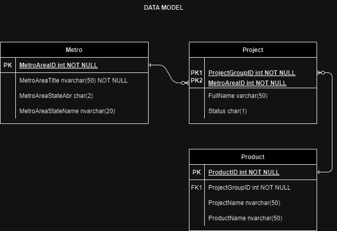

- [Overview](#overview)
- [Data Model](#data-model)
- [Technologies](#technologies)
- [Usage](#usage)
- [API Definition](#api-definition)
  - [Search](#search)
    - [Search Response](#search-response)

---

# Overview

In this technical assessment we build a backend API using .NET 8 and a simple frontend in React.
The backend system supports searching and the frontend displays the results in a grid.

This is outlined in the Requirements.pdf document.

Notes: Could not insert the NULL values in the Product table because sqlite would not
      accept it.  Perhaps using another larger DB system (i.e. SQL Server) this might
      have been possible.

Due to the limited amout of data the search endpoint was only implemented to return
all rows from the DB.  In a larger data set a search parameter might be more
appropriate.

# Data Model

<div align="left">



</div>

# Technologies

Draw.io
Sqlite.com
EFCore
Dot.Net Core 8
React.com
React data table


# Usage

Clone backend repo `git clone https://github.com/jensserna/stanleymartinhomes/backend`

Navigate to backend directory `cd backend`

Create and seed DB `dotnet ef migrations add InitialCreate`, `dotnet ef database update`

Run backend `dotnet run --project backend`

Clone frontend repo `git clone https://github.com/jensserna/stanleymartinhomes/frontend`

Navigate to frontend directory `cd frontend`

Run frontend `npm start`


# API Definition


## Search

```js
GET /search
```

### Search Response

```js
200 Ok
```

```json
[
  {
    "ProductId": "E15",
    "ProductName": "Inwood",
    "ProjectName": "Inwood SFD",
    "MetroAreaId": 1007,
    "MetroAreaTitle": "Atlanta",
    "MetroAreaStateAbr": "GA",
    "MetroAreaStateName": "Georgia",
    "FullName": "Inwood",
    "ProjectGroupId": 25,
    "Status": "a"
  },
  {
    "ProductId": "E15",
    "ProductName": "The Amelia",
    "ProjectName": "Edgewater 50",
    "MetroAreaId": 1007,
    "MetroAreaTitle": "Atlanta",
    "MetroAreaStateAbr": "GA",
    "MetroAreaStateName": "Georgia",
    "FullName": "Edgewater",
    "ProjectGroupId": 23,
    "Status": "a"
  },
  {
    "ProductId": "980",
    "ProductName": "The Davis",
    "ProjectName": "Edgewater 50",
    "MetroAreaId": 1007,
    "MetroAreaTitle": "Atlanta",
    "MetroAreaStateAbr": "GA",
    "MetroAreaStateName": "Georgia",
    "FullName": "Edgewater",
    "ProjectGroupId": 23,
    "Status": "a"
  },
  {
    "ProductId": "980",
    "ProductName": "The Dupree",
    "ProjectName": "Inwood SFD",
    "MetroAreaId": 1007,
    "MetroAreaTitle": "Atlanta",
    "MetroAreaStateAbr": "GA",
    "MetroAreaStateName": "Georgia",
    "FullName": "Inwood",
    "ProjectGroupId": 25,
    "Status": "a"
  },
  {
    "ProductId": "Y54",
    "ProductName": "The Lockwood",
    "ProjectName": "Edgewater 50",
    "MetroAreaId": 1007,
    "MetroAreaTitle": "Atlanta",
    "MetroAreaStateAbr": "GA",
    "MetroAreaStateName": "Georgia",
    "FullName": "Edgewater",
    "ProjectGroupId": 23,
    "Status": "a"
  },
  {
    "ProductId": "1601",
    "ProductName": "The Moultrie",
    "ProjectName": "Estuary",
    "MetroAreaId": 1008,
    "MetroAreaTitle": "Charleston",
    "MetroAreaStateAbr": "SC",
    "MetroAreaStateName": "South Carolina",
    "FullName": "Estuary at Bowen Village",
    "ProjectGroupId": 41,
    "Status": "a"
  },
  {
    "ProductId": "Y58",
    "ProductName": "The Prescot",
    "ProjectName": "Edgewater",
    "MetroAreaId": 1007,
    "MetroAreaTitle": "Atlanta",
    "MetroAreaStateAbr": "GA",
    "MetroAreaStateName": "Georgia",
    "FullName": "Edgewater",
    "ProjectGroupId": 23,
    "Status": "a"
  },
  {
    "ProductId": "1674",
    "ProductName": "The Stella",
    "ProjectName": "Mixson",
    "MetroAreaId": 1008,
    "MetroAreaTitle": "Charleston",
    "MetroAreaStateAbr": "SC",
    "MetroAreaStateName": "South Carolina",
    "FullName": "Mixson",
    "ProjectGroupId": 43,
    "Status": "i"
  },
  {
    "ProductId": "U68",
    "ProductName": "The Stono",
    "ProjectName": "Estuary",
    "MetroAreaId": 1008,
    "MetroAreaTitle": "Charleston",
    "MetroAreaStateAbr": "SC",
    "MetroAreaStateName": "South Carolina",
    "FullName": "Estuary at Bowen Village",
    "ProjectGroupId": 41,
    "Status": "a"
  },
  {
    "ProductId": "1665",
    "ProductName": "The Tidalview",
    "ProjectName": "Oldfield",
    "MetroAreaId": 1008,
    "MetroAreaTitle": "Charleston",
    "MetroAreaStateAbr": "SC",
    "MetroAreaStateName": "South Carolina",
    "FullName": "Oldfield",
    "ProjectGroupId": 47,
    "Status": "a"
  }
]
```